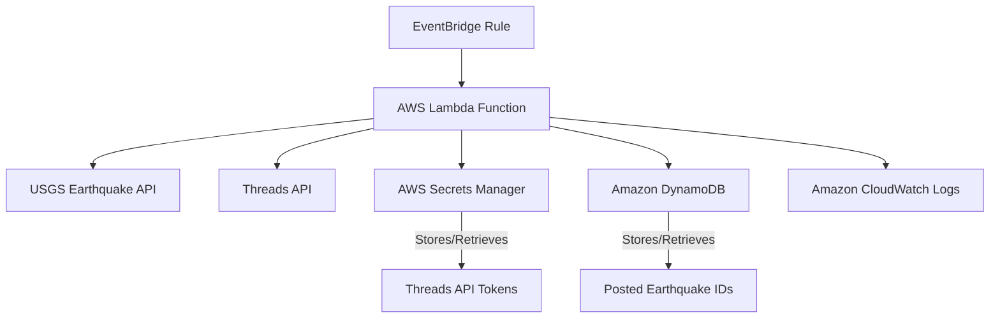

# System Patterns: SeattleEarthquakeAlerts Threads Bot

## System Architecture

The system follows a serverless architecture on AWS.

## Key technical decisions

*   **Serverless:** Chosen for cost-effectiveness and reduced operational overhead.
*   **TypeScript:** Selected as the implementation language for both bot logic and infrastructure (CDK).
*   **AWS CDK:** Used for defining and deploying the AWS infrastructure in a programmatic and repeatable way.
*   **OAuth 2.0 Authorization Code Grant:** Standard and secure method for obtaining access to the Threads API.
*   **Secrets Manager:** Secure storage for sensitive API credentials and tokens.
*   **DynamoDB:** Simple, scalable, and cost-effective NoSQL database for storing posted earthquake IDs for deduplication.
*   **EventBridge:** Reliable and easy-to-configure service for scheduling the Lambda function.

## Design patterns in use

*   **Event-Driven Architecture:** The system is triggered by scheduled events from EventBridge.
*   **Microservice-like Components:** The bot logic can be seen as a single-purpose microservice.
*   **Infrastructure as Code:** Using CDK to manage infrastructure.

## Component relationships

*   **EventBridge** triggers the **Lambda Function**.
*   **Lambda Function** interacts with **USGS Earthquake API** to get data.
*   **Lambda Function** interacts with **Threads API** to post alerts.
*   **Lambda Function** interacts with **Secrets Manager** to manage API tokens.
*   **Lambda Function** interacts with **DynamoDB** to manage posted earthquake state.
*   **Lambda Function** sends logs to **CloudWatch Logs**.

## Critical implementation paths

*   Successful retrieval and refresh of Threads API tokens.
*   Reliable fetching and filtering of USGS earthquake data.
*   Correct formatting and successful posting of alerts to Threads.
*   Accurate tracking of posted earthquakes in DynamoDB to prevent duplicates.
